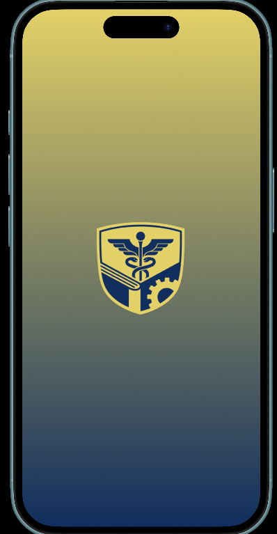
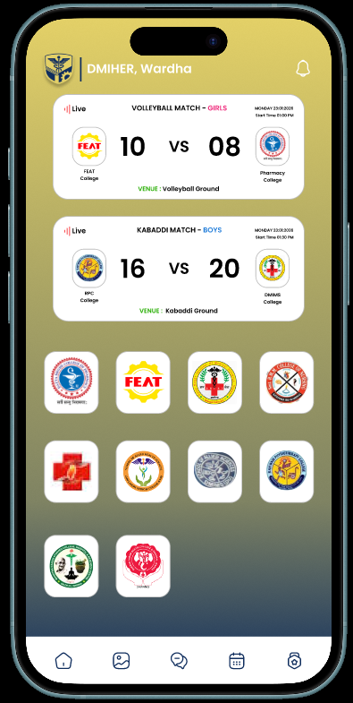
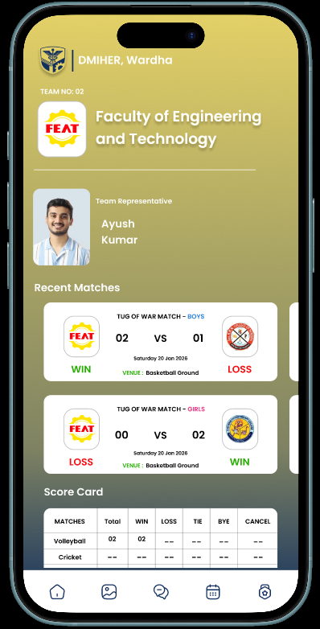
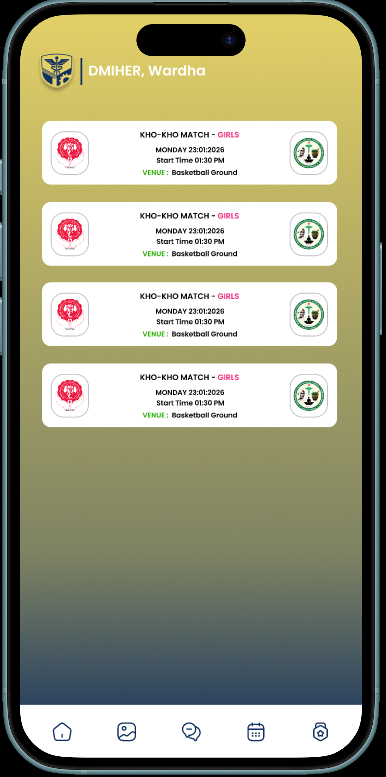
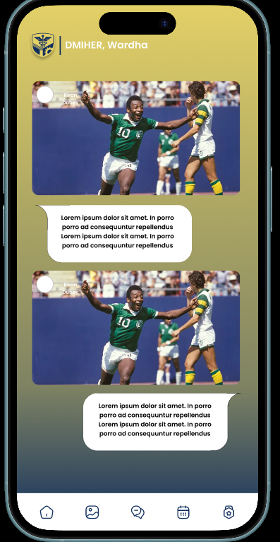

# Campus Sports Live Score & Management System

## Overview

Campus Sports Live Score & Management System is a mobile application designed to simplify and digitize sports tournament management within colleges and universities.

The application provides a centralized platform where students, spectators, and authorized college members can view live scores, match schedules, team information, and tournament updates in real time.

This repository presents the UI/UX design prototype developed using Flutter.

---

## Project Objectives

* Digitize sports event management
* Provide real-time match score updates
* Improve transparency in tournament tracking
* Increase student participation and engagement
* Reduce manual record-keeping and scoring errors
* Create a centralized platform for sports activities

---

## Key Features

### Live Score Tracking

* Real-time match score updates
* Ongoing match status monitoring
* Instant result display

### Team Management

* Team profiles
* Team representative information
* Team participation details

### Match Management

* Upcoming match schedules
* Match venue information
* Match history records

### Points Table and Rankings

* Automatic ranking calculation
* Team standings
* Tournament progress tracking

### Audience Interaction

* Comment sharing
* Match discussion
* Community engagement

### Media Sharing

* Match photo uploads
* Event image sharing

### Authentication

* Restricted access for authorized users
* Secure login system

### QR Code Access

* Quick access to match information
* Fast score viewing

---

## Technology Stack

**Frontend:** Flutter

**Programming Language:** Dart

**Backend:** Firebase

**Database:** Cloud Firestore

**Authentication:** Firebase Authentication

**Storage:** Firebase Storage

---

## Application Screens

### Splash Screen

Application startup screen displaying institutional branding.

---

### Home Screen

Displays live matches, current scores, and participating teams.

---

### Team Profile Screen

Shows team details, representative information, recent matches, and score statistics.

---

### Upcoming Match Screen

Displays upcoming matches along with date, time, and venue information.

---

### Community Interaction Screen

Allows users to share comments and event-related media.

---

## Current Scope

The current prototype includes:

* User interface design
* Live score viewing screens
* Team information screens
* Match scheduling screens
* Audience interaction screens

---

## Future Enhancements

* Admin dashboard
* Tournament management panel
* Automated match scheduling
* Push notifications
* Advanced analytics and reports
* Player performance tracking
* QR-based event management

---

## Repository Status

This repository contains the UI/UX design prototype of the Campus Sports Live Score & Management System.

The source code, backend implementation, and production deployment are not included in this repository.

---

Developed as a project focused on improving sports event management and engagement within educational institutions.
